# Architecture Diagrams

## 1. Infrastructure Ecosystem Overview

```mermaid
graph TB
    subgraph "Developer Experience"
        DEV[👨‍💻 Developer]
        YAML[📄 YAML Config]
        DEV --> YAML
    end

    subgraph "Template Repository"
        TPL[🏗️ iac-pipeline-templates<br/>v0.0.1]
        subgraph "Pipeline Templates"
            ADO_T[Azure DevOps Templates]
            GH_T[GitHub Actions Templates]
            AWS_T[AWS CodePipeline Templates]
            OCI_T[Oracle DevOps Templates]
        end
        TPL --> ADO_T
        TPL --> GH_T
        TPL --> AWS_T
        TPL --> OCI_T
    end

    subgraph "Infrastructure Modules"
        COMPUTE[🖥️ iac-molecule-compute]
        FUTURE1[🔮 iac-atom-network]
        FUTURE2[🔮 iac-molecule-storage]
        FUTURE3[🔮 iac-template-app]
    end

    subgraph "CI/CD Platforms"
        ADO[🔵 Azure DevOps]
        GHA[⚫ GitHub Actions]
        AWS[🟠 AWS CodePipeline]
        OCI[🔴 Oracle Cloud DevOps]
    end

    subgraph "Cloud Providers"
        AZURE[☁️ Azure VMs]
        AWSEC2[☁️ AWS EC2]
        CIVO[☁️ Civo Instances]
        OCIVM[☁️ OCI Compute]
    end

    subgraph "State & Registry"
        TFC[🏛️ Terraform Cloud<br/>State & Registry]
    end

    %% Connections
    YAML --> COMPUTE
    COMPUTE -.-> TPL
    
    COMPUTE --> ADO
    COMPUTE --> GHA
    COMPUTE --> AWS
    COMPUTE --> OCI
    
    ADO --> AZURE
    GHA --> AWSEC2
    AWS --> CIVO
    OCI --> OCIVM
    
    ADO --> TFC
    GHA --> TFC
    AWS --> TFC
    OCI --> TFC

    %% Styling
    classDef developer fill:#e1f5fe
    classDef template fill:#f3e5f5
    classDef module fill:#e8f5e8
    classDef cicd fill:#fff3e0
    classDef cloud fill:#fce4ec
    classDef state fill:#f1f8e9

    class DEV,YAML developer
    class TPL,ADO_T,GH_T,AWS_T,OCI_T template
    class COMPUTE,FUTURE1,FUTURE2,FUTURE3 module
    class ADO,GHA,AWS,OCI cicd
    class AZURE,AWSEC2,CIVO,OCIVM cloud
    class TFC state
```



## 2. Release Workflow Process

```mermaid
flowchart TD
    START[👨‍💻 Developer starts work]
    BRANCH[🌿 Create feature branch]
    DEVELOP[💻 Develop & commit]
    
    subgraph "Commit Message Decision"
        MSG{Commit Message?}
        ADO_MSG["[ado] feat: new feature"]
        GH_MSG["[gh] feat: new feature"]
        AWS_MSG["[aws] feat: new feature"]
        OCI_MSG["[oci] feat: new feature"]
        DEFAULT_MSG["feat: new feature<br/>(defaults to ADO)"]
    end

    subgraph "Pipeline Execution"
        COMMIT_CHECK[🔍 Commit Check]
        PLAN[📋 Plan Stage]
        TEST[🔒 Test Stage<br/>Security & Linting]
        
        RELEASE_FLAG{Has [release] flag?}
        CREATE_PR[📝 Create PR Stage]
        SKIP_PR[⏭️ Skip PR Creation]
    end

    subgraph "Review Process"
        PR_REVIEW[👥 Team Review]
        APPROVAL{Approval Message?}
        MAJOR["APPROVED MAJOR<br/>v1.0.0 → v2.0.0"]
        MINOR["APPROVED MINOR<br/>v1.0.0 → v1.1.0"]
        PATCH["APPROVED PATCH<br/>v1.0.0 → v1.0.1"]
    end

    subgraph "Release Execution"
        MERGE[🔀 Merge to main]
        RELEASE_STAGE[🚀 Release Stage]
        VERSION[🏷️ Create Git Tag]
        PUBLISH[📦 Publish to Terraform Cloud]
    end

    %% Flow
    START --> BRANCH
    BRANCH --> DEVELOP
    DEVELOP --> MSG
    
    MSG --> ADO_MSG
    MSG --> GH_MSG
    MSG --> AWS_MSG
    MSG --> OCI_MSG
    MSG --> DEFAULT_MSG
    
    ADO_MSG --> COMMIT_CHECK
    GH_MSG --> COMMIT_CHECK
    AWS_MSG --> COMMIT_CHECK
    OCI_MSG --> COMMIT_CHECK
    DEFAULT_MSG --> COMMIT_CHECK
    
    COMMIT_CHECK --> PLAN
    PLAN --> TEST
    TEST --> RELEASE_FLAG
    
    RELEASE_FLAG -->|Yes| CREATE_PR
    RELEASE_FLAG -->|No| SKIP_PR
    
    CREATE_PR --> PR_REVIEW
    PR_REVIEW --> APPROVAL
    
    APPROVAL --> MAJOR
    APPROVAL --> MINOR
    APPROVAL --> PATCH
    
    MAJOR --> MERGE
    MINOR --> MERGE
    PATCH --> MERGE
    
    MERGE --> RELEASE_STAGE
    RELEASE_STAGE --> VERSION
    VERSION --> PUBLISH

    %% Styling
    classDef process fill:#e3f2fd
    classDef decision fill:#fff3e0
    classDef action fill:#e8f5e8
    classDef review fill:#fce4ec
    classDef release fill:#f3e5f5

    class START,BRANCH,DEVELOP,COMMIT_CHECK,PLAN,TEST,CREATE_PR,SKIP_PR process
    class MSG,RELEASE_FLAG,APPROVAL decision
    class ADO_MSG,GH_MSG,AWS_MSG,OCI_MSG,DEFAULT_MSG action
    class PR_REVIEW,MAJOR,MINOR,PATCH review
    class MERGE,RELEASE_STAGE,VERSION,PUBLISH release
```

## 3. Multi-Platform Pipeline Architecture

```mermaid
graph LR
    subgraph "Source Control"
        REPO[📁 iac-molecule-compute]
        COMMIT[💬 Commit Message<br/>[platform][release] message]
    end

    subgraph "Pipeline Templates"
        TEMPLATES[🏗️ iac-pipeline-templates<br/>v0.0.1]
    end

    subgraph "CI/CD Platform Routing"
        ADO_PIPE[🔵 Azure DevOps<br/>pipeline.yml]
        GH_PIPE[⚫ GitHub Actions<br/>plan-test-release.yml]
        AWS_PIPE[🟠 AWS CodePipeline<br/>pipeline-complete.yaml]
        OCI_PIPE[🔴 Oracle DevOps<br/>build_spec.yaml]
    end

    subgraph "Execution Stages"
        STAGE1[1️⃣ Commit Check<br/>Platform Filtering]
        STAGE2[2️⃣ Plan<br/>Module Testing]
        STAGE3[3️⃣ Test<br/>Security & Linting]
        STAGE4[4️⃣ Create PR<br/>Conditional]
        STAGE5[5️⃣ Release<br/>Versioning & Publishing]
    end

    subgraph "Target Infrastructure"
        AZURE_VM[☁️ Azure VMs]
        AWS_EC2[☁️ AWS EC2]
        CIVO_VM[☁️ Civo Instances]
        OCI_VM[☁️ OCI Compute]
    end

    subgraph "State Management"
        TF_CLOUD[🏛️ Terraform Cloud<br/>State & Module Registry]
    end

    %% Connections
    REPO --> COMMIT
    COMMIT --> ADO_PIPE
    COMMIT --> GH_PIPE
    COMMIT --> AWS_PIPE
    COMMIT --> OCI_PIPE

    TEMPLATES -.-> ADO_PIPE
    TEMPLATES -.-> GH_PIPE
    TEMPLATES -.-> AWS_PIPE
    TEMPLATES -.-> OCI_PIPE

    ADO_PIPE --> STAGE1
    GH_PIPE --> STAGE1
    AWS_PIPE --> STAGE1
    OCI_PIPE --> STAGE1

    STAGE1 --> STAGE2
    STAGE2 --> STAGE3
    STAGE3 --> STAGE4
    STAGE4 --> STAGE5

    STAGE2 --> AZURE_VM
    STAGE2 --> AWS_EC2
    STAGE2 --> CIVO_VM
    STAGE2 --> OCI_VM

    STAGE5 --> TF_CLOUD

    %% Styling
    classDef source fill:#e1f5fe
    classDef template fill:#f3e5f5
    classDef pipeline fill:#fff3e0
    classDef stage fill:#e8f5e8
    classDef cloud fill:#fce4ec
    classDef state fill:#f1f8e9

    class REPO,COMMIT source
    class TEMPLATES template
    class ADO_PIPE,GH_PIPE,AWS_PIPE,OCI_PIPE pipeline
    class STAGE1,STAGE2,STAGE3,STAGE4,STAGE5 stage
    class AZURE_VM,AWS_EC2,CIVO_VM,OCI_VM cloud
    class TF_CLOUD state
```

## 4. Commit Message Routing Logic

```mermaid
flowchart TD
    COMMIT[💬 Git Commit Message]
    
    subgraph "Message Parsing"
        CHECK_ADO{Contains '[ado]'?}
        CHECK_GH{Contains '[gh]'?}
        CHECK_AWS{Contains '[aws]'?}
        CHECK_OCI{Contains '[oci]'?}
        CHECK_RELEASE{Contains '[release]'?}
    end

    subgraph "Platform Execution"
        RUN_ADO[🔵 Run Azure DevOps]
        RUN_GH[⚫ Run GitHub Actions]
        RUN_AWS[🟠 Run AWS CodePipeline]
        RUN_OCI[🔴 Run Oracle DevOps]
        RUN_DEFAULT[🔵 Run Azure DevOps<br/>(Default)]
    end

    subgraph "Stage Control"
        NORMAL_STAGES[📋 Plan → Test]
        PR_STAGES[📋 Plan → Test → Create PR]
        RELEASE_STAGES[📋 Plan → Test → Release]
    end

    subgraph "Examples"
        EX1["[ado] feat: new feature"]
        EX2["[gh][release] feat: ready"]
        EX3["[aws] fix: bug fix"]
        EX4["feat: no prefix"]
    end

    %% Flow
    COMMIT --> CHECK_ADO
    COMMIT --> CHECK_GH
    COMMIT --> CHECK_AWS
    COMMIT --> CHECK_OCI
    COMMIT --> CHECK_RELEASE

    CHECK_ADO -->|Yes| RUN_ADO
    CHECK_GH -->|Yes| RUN_GH
    CHECK_AWS -->|Yes| RUN_AWS
    CHECK_OCI -->|Yes| RUN_OCI
    
    CHECK_ADO -->|No| CHECK_GH
    CHECK_GH -->|No| CHECK_AWS
    CHECK_AWS -->|No| CHECK_OCI
    CHECK_OCI -->|No| RUN_DEFAULT

    CHECK_RELEASE -->|Yes + Feature Branch| PR_STAGES
    CHECK_RELEASE -->|Yes + Main Branch| RELEASE_STAGES
    CHECK_RELEASE -->|No| NORMAL_STAGES

    %% Examples
    EX1 --> RUN_ADO
    EX2 --> RUN_GH
    EX3 --> RUN_AWS
    EX4 --> RUN_DEFAULT

    %% Styling
    classDef commit fill:#e1f5fe
    classDef decision fill:#fff3e0
    classDef platform fill:#e8f5e8
    classDef stage fill:#fce4ec
    classDef example fill:#f3e5f5

    class COMMIT commit
    class CHECK_ADO,CHECK_GH,CHECK_AWS,CHECK_OCI,CHECK_RELEASE decision
    class RUN_ADO,RUN_GH,RUN_AWS,RUN_OCI,RUN_DEFAULT platform
    class NORMAL_STAGES,PR_STAGES,RELEASE_STAGES stage
    class EX1,EX2,EX3,EX4 example
```